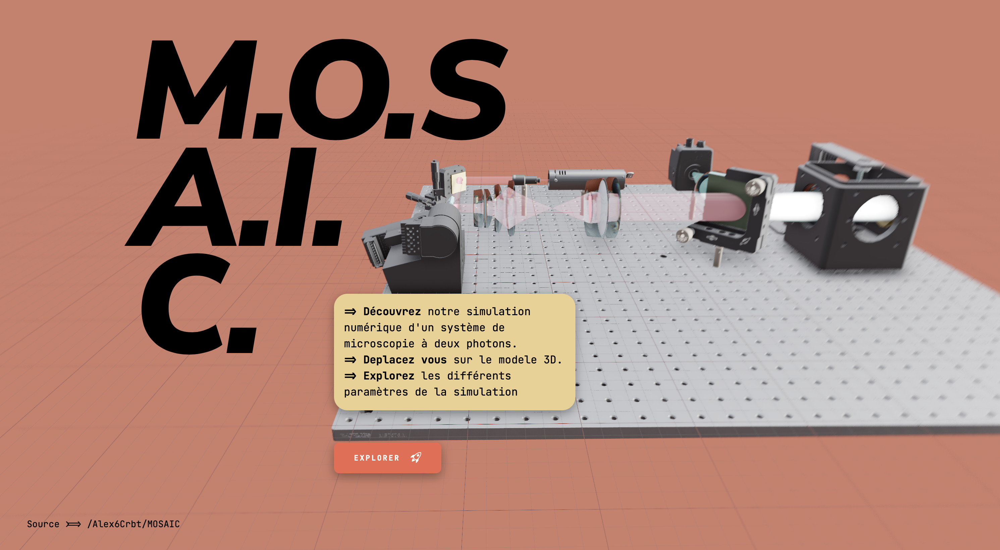

# MOSAIC – Demo Web App
<a name="readme-top"></a>
> A Demo webapp and image processing code for the Mosaic project – Explore a 2 photons microscopy system using a Schmidt optical system

[](https://github.com/pmndrs/react-three-fiber) [](https://github.com/alex6crbt/Mosaic/blob/web_app/LICENSE) [](https://alex6crbt.github.io/Mosaic/) 

<br />
<div align="center">
  <a href="https://alex6crbt.github.io/Mosaic/">
    
  </a>

  <h3 align="center">Mosaic - 2 photons microscopy</h3>

  <p align="center">
    Dive into the world of biological sample imaging with our web application designed to explore a high-resolution two-photon fluorescence microscopy system.
    <br />
    <a href="https://alex6crbt.github.io/Mosaic"><strong>See a demo »</strong></a>
    <br />
    <br />
    <a href="https://github.com/Alex6Crbt/Mosaic/tree/main/src"><strong>Code »</strong></a>    
    ·
    <a href="https://github.com/Alex6Crbt/Mosaic/issues">Report a bug</a>
    ·
    <a href="https://github.com/Alex6Crbt/Mosaic/issues">Ask for a feature</a>
  </p>
</div>

### Python packages :

```sh
pip install -r requirements.txt
```


<details>
  <summary>Table of Contents</summary>
  <ol>
    <li><a href="#Demo">Demo</a></li>
    <li>
      <a href="#getting-started">Getting Started</a>
      <ul>
        <li><a href="#prerequisites">Prerequisites</a></li>
        <li><a href="#installation">Installation</a></li>
      </ul>
    </li>
    <li><a href="#contributing">Contributing</a></li>
    <li><a href="#contact">Bug / Feature Request</a></li>
    <li><a href="#built-with">Built With</a></li>
    <li><a href="#acknowledgments">To-do</a></li>
    <li><a href="#license">License</a></li>
  </ol>
</details>

## [Demo](https://alex6crbt.github.io/Mosaic/)
Here is a working live demo :  https://alex6crbt.github.io/Mosaic/


## Getting Started


### Prerequisites

Make sure you have Node and npm installed

### Installation

To run locally the app run the folowing :

1. Clone the repo
```sh
git clone https://github.com/alex6crbt/Mosaic.git
```
3. Install NPM packages
```sh
npm install
```
4. Start the app
```sh
npm run dev
```


## Contributing
Want to contribute? Great!

To fix a bug or enhance an existing module, follow these steps:

- Fork the repo
- Create a new branch (`git checkout -b improve-feature`)
- Make the appropriate changes in the files
- Add changes to reflect the changes made
- Commit your changes (`git commit -am 'Improve feature'`)
- Push to the branch (`git push origin improve-feature`)
- Create a Pull Request 

## Bug / Feature Request

Spotted a bug? Let us know by opening an issue [here](https://github.com/alex6crbt/Mosaic/issues/new), detailing the bug and the expected outcome.

Have an idea for a new feature? Share your thoughts by opening an issue [here](https://github.com/alex6crbt/Mosaic/issues/new). Don’t forget to include the details of the feature you'd like to see implemented.

## Built with

- [React](https://react.dev) - The library for web and native user interfaces
- [Vite](https://vitejs.dev) - A tool that aims to provide a faster and leaner development experience for modern web projects
- [Bootstrap](http://getbootstrap.com/) - Extensive list of components and  Bundled Javascript plugins.
- [react-three-fiber](https://github.com/pmndrs/react-three-fiber) - React-three-fiber is a React renderer for three.js.
* [@react-three/drei](https://github.com/pmndrs/drei) – useful helpers, this is an eco system in itself
* [@react-three/gltfjsx](https://github.com/pmndrs/gltfjsx) – turns GLTFs into JSX components
* [@react-three/postprocessing](https://github.com/pmndrs/react-postprocessing) – post-processing effects

## To-do
- [x] Add images in the exploration
- [ ] Add the scanning animation


## [License](https://github.com/alex6crbt/Mosaic/blob/web_app/LICENSE)

[  Apache License](http://www.apache.org/licenses/)

<p align="right">(<a href="#readme-top">back to top</a>)</p>